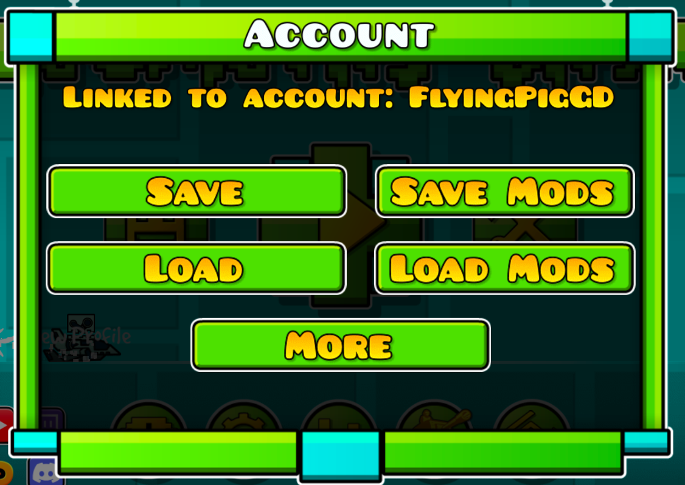
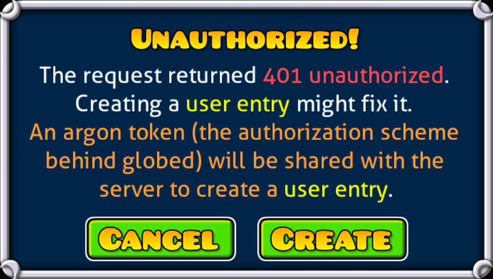
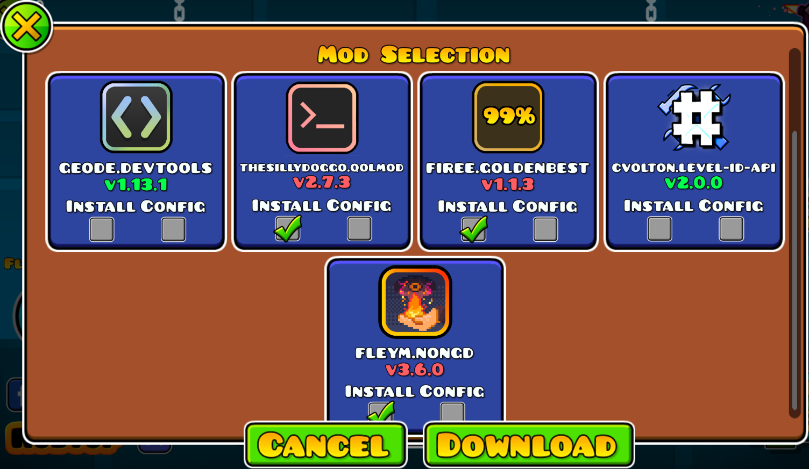
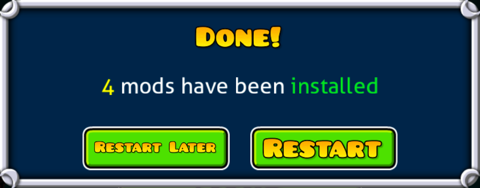

# Mod Fetcher

This mod allows you to save and load your mods and configs between computers.

Two new buttons are added to the "Account" menu in "Settings", "Save Mods" and "Load Mods"

If you have not created a user entry, clicking either button with show

Clicking create will create a user entry on the server using an argon token.

Clicking save after creating a user entry will save your mods and configs to the server.

Clicking load will show a popup detailing the mods found on the server.

A red version means you do not have the mod installed, a yellow version means you do have the mod installed,
but a lower version, and a green version means you have the mod installed and the same or higher version.

Mods that are not installed or are an inferior version will be automatically selected for installation.
Configs can also be synced through toggling the "Config" toggler in a mod's info box.

Once you load the mods you will be prompted to restart the game.

After restarting, if a mod's config is synced and requires it, you will be prompted to, once again,
restart your game.

### Additional Information
The [server software](https://github.com/FlyingPig525/modfetcher-server) can be self-hosted and the server
ip can be configured in the mod's settings.

### Credits
- Thanks to [capeling](https://github.com/Capeling) for creating the mod logo template